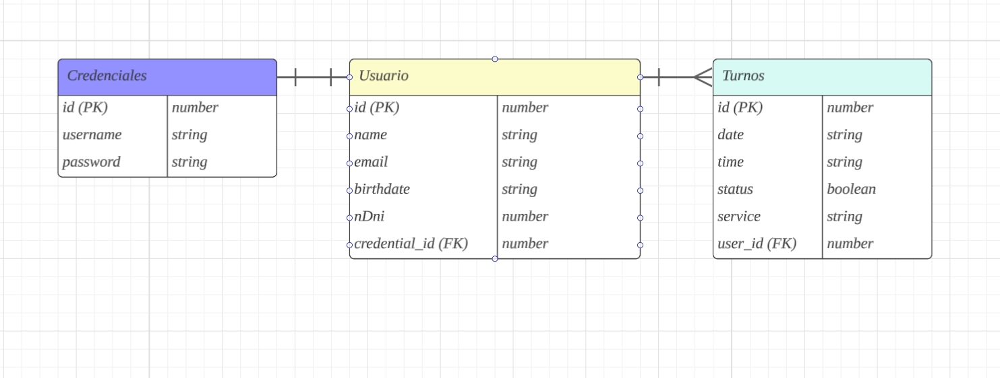

# User Stories

- Yo como usuario invitado quiero:

1. Poder acceder al sitio web y ver contenido.
2. Poder registrarme en el sitio web y crear una nueva cuenta.

---

- Yo como usuario registrado quiero:

1. Poder logearme (iniciar sesión) con mis credenciales.
2. Poder deslogearme (cerrar sesión).
3. Poder modificar mi foto de perfil.
4. Poder reservar un turno. // Se dará un aviso por mail del turno asignado.

- Debo poder elegir un día para mi turno (dentro de los días de atención del establecimiento).
- Debo poder elegir un horario para mi turno (dentro del horario de atención del establecimiento).
- Debo poder elegir el tipo de servicio a solicitar.
- Debo poder ver un listado de mis turnos (activos y cancelados).
- Debo poder cancelar un turno. // Se dará un aviso por mail de la cancelación del turno

# UX / UI

- Agradable a la vista en todas las pages.
- Landing de bienvenida.
- Home con información.
- Landing con imagenes de clientes.
- Formularios de registro, login y reserva de turnos.
  - Intuitivo, con validaciones (campos obligatorios) y mensajes de errores (sin reiniciarse si algo es inválido)
- Mensajes de respuesta ante una acción.

# Diagrama E/R

